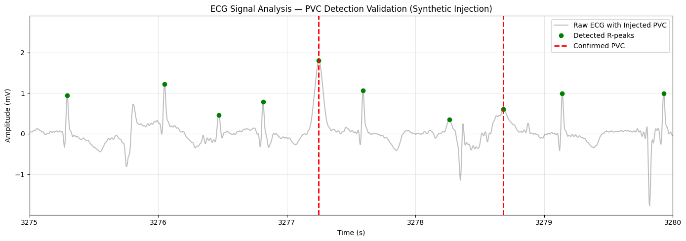

# Robust Algorithmic Pipeline for Clinical ECG Processing and Autonomic Nervous System Evaluation

<div align="center">
  
  
  
  
</div>

## 📑 Abstract

This repository presents an end-to-end biomedical digital signal processing (DSP) pipeline for the extraction, conditioning, and clinical analysis of Electrocardiogram (ECG) data. The pipeline applies adaptive filtering to remove common artifacts, extracts R-peaks, performs time-domain Heart Rate Variability (HRV) analysis, and implements advanced ectopic beat detection (PVCs). It was built as a learning project to explore the core techniques used in biomedical signal processing, with the long-term goal of applying these fundamentals to more advanced physiological monitoring systems.

---

## 🔬 Methodology & Architecture
The signal processing pipeline is organized into six sequential stages, each modularized in its own file:

### 1. 01_biomedical_signal_analysis.py — Baseline Signal Exploration
Data is sourced directly from the MIT-BIH Arrhythmia Database (sampled at 360 Hz). This stage isolates the raw signal, removes baseline wander (DC offset), and performs an initial, unfiltered R-peak detection to establish a reference point.

### 2. 02_Filtered_ECG_Analysis.py — Spectral Analysis & Filtering
To improve signal quality before peak detection, this stage applies two filters:
* **Zero-Phase IIR Notch Filter:** Targets and attenuates 50 Hz powerline interference ($Q=30$).
* **4th-Order Butterworth Low-Pass Filter:** Suppresses high-frequency artifacts (e.g., muscle/EMG noise) with a cutoff frequency ($f_c$) of 30 Hz.

R-peaks are then detected on the filtered signal using `scipy.signal.find_peaks` with adaptive height and distance thresholds derived from the signal's own statistics (median and percentile-based), rather than fixed hardcoded values.

<div align="center">
  
  <br>
  <em>Figure 1: Spectral analysis (FFT) demonstrating the isolation and attenuation of 50 Hz powerline interference using a zero-phase Notch filter.</em>
  
  <br><br>

  
  <br>
  <em>Figure 2: Signal conditioning utilizing a 4th-Order Butterworth Low-Pass filter to suppress high-frequency physiological artifacts (e.g., EMG noise) while preserving critical QRS morphology.</em>
</div>

<div align="center">
  
  <br>
  <em>Figure 3: Filtered ECG signal showcasing automated R-peak detection (red markers) utilizing dynamic thresholding (green dashed line).</em>
</div>

### 3. 03_HRV_and_Arrhythmia_Flagging.py — HRV & Rule-Based Flagging
Beyond R-peak detection, this stage computes R-R intervals and derives standard time-domain HRV metrics:
* **SDNN** — Standard deviation of R-R intervals; reflects overall heart rate variability.
* **RMSSD** — Root mean square of successive R-R differences; a common indicator of parasympathetic (vagal) activity.
* **pNN50** — Percentage of successive R-R interval differences exceeding 50 ms.

Average BPM is also compared against standard resting-heart-rate thresholds to flag the recording as consistent with bradycardia (<60 BPM) or tachycardia (>100 BPM). This is a simple rule-based classification of the dataset, not a clinical diagnostic tool.

<div align="center">
  
  <br>
  <em>Figure 4: Heart Rate Variability (HRV) metrics extraction and arrhythmia diagnostic flagging.</em>
</div>

### 4. 04_PVC_Detection.py — Advanced Arrhythmia Detection & Synthetic Validation
This newly integrated module focuses on identifying Premature Ventricular Contractions (PVCs) utilizing the **Icentia11k Database** (sampled at 250 Hz). The algorithm employs a dual-criteria validation system:
1. **Temporal Analysis (R-R Disturbance):** Flags beats arriving significantly earlier than the patient's median R-R baseline (< 75%) and evaluates the presence of a compensatory pause.
2. **Morphological Correlation:** Segments early candidates and computes a Pearson correlation coefficient against a dynamically generated "normal beat" template to isolate widened, distorted waveforms.

**Synthetic Validation:** To rigorously validate the detector, the script injects a synthetic PVC waveform (a high-amplitude Gaussian pulse) into the physiological data. The entire pipeline is re-run to confirm the system's ability to blindly isolate the morphological abnormality.

<div align="center">
  
  <br>
  <em>Figure 5: Synthetic Validation — The algorithm successfully detects R-peaks (green) and strictly isolates the synthetically injected ectopic beat (red dashed lines).</em>
</div>

### 5. 05_feature_extraction.py — Feature Extraction on MIT-BIH (Record 116)
This stage re-applies the PVC detection logic from Stage 4 to a second, independent clinical record (MIT-BIH record 116, sampled at 360 Hz) to test the detector's generalizability across datasets. The signal is bandpass-filtered (0.5–30 Hz), R-peaks are located with adaptive height/prominence thresholds, and each beat is scored against the same dual-criteria logic:
* **Timing:** R-R interval falling below 75% of the patient's median R-R.
* **Compensatory pause:** Sum of the surrounding R-R intervals approximating twice the median.
* **Morphology:** Pearson correlation against a per-record "normal beat" template.

Rather than only printing detections, this script exports every beat's features (`RR_PRE`, `RR_POST`, `CORR`, `COMPENSATORY`) and its resulting label to `ecg_features.csv`, turning the rule-based detector into a labeled dataset for supervised learning in the next stage.

### 6. 06_model_training.py — Machine Learning Classification
This stage moves from rule-based detection to a data-driven approach, comparing two classifiers on the feature table produced in Stage 5 to evaluate whether the hand-engineered features (R-R timing, compensatory pause, morphological correlation) are sufficient to separate PVC from normal beats.
* **Logistic Regression** — a simple, interpretable linear baseline.
* **Random Forest** (`class_weight='balanced'`) — a non-linear ensemble model better able to capture feature interactions, with class weighting used to compensate for the PVC/normal class imbalance.
* Data is split 80/20 into training and test sets, and both models are evaluated with a **confusion matrix** and a full **classification report** (precision, recall, F1-score), since PVCs are a minority class and plain accuracy would be a misleading metric.
* **Feature importance** from the Random Forest is also inspected to sanity-check which engineered features are actually driving the model's decisions.

This stage is exploratory — a first comparison of modeling approaches and a check on feature quality — rather than a tuned, production-ready classifier.

---

## ⚠️ Scope & Limitations
This project was developed for learning and portfolio purposes. A few things worth noting:
* Peak-detection thresholds and filter parameters were tuned on specific MIT-BIH and Icentia11k records and have not been validated across the full databases.
* The bradycardia/tachycardia flagging is a simple threshold rule, not a validated diagnostic method.
* The Stage 6 classifier is trained on a single record's features and has not been validated across patients — it is a proof of concept for the feature set, not a generalizable model.
* This pipeline has not been tested for real-time / low-latency use and is not intended for clinical or medical-device applications in its current form.
 
---

## 🚀 Potential Future Directions
The techniques implemented here — digital filtering, adaptive peak detection, HRV analysis, and PVC isolation — are foundational building blocks for more advanced physiological monitoring systems (e.g., wearable devices or home health-monitoring tools). Validating these algorithms against a broader set of records and optimizing the pipeline for continuous, real-time data streaming are natural next steps.

---

## 💻 Technical Stack
* **Language:** Python 3.x
* **Core Libraries:** `numpy` (array operations), `scipy` (FFT, signal filtering, peak detection), `matplotlib` (plotting), `wfdb` (reading PhysioNet data), `pandas` (feature tables), `scikit-learn` (train/test split, Logistic Regression, Random Forest, evaluation metrics)

### Installation & Execution

```bash
# 1. Clone the repository:
git clone [https://github.com/ali-xfactor/biomedical_signal_analysis.git](https://github.com/ali-xfactor/biomedical_signal_analysis.git)

# 2. Install dependencies:
pip install numpy scipy matplotlib wfdb pandas scikit-learn

# 3. Download the datasets:
# - Download MIT-BIH records (e.g., 100 or 122) for Stages 1-3.
# - Download Icentia11k records (e.g., p01000_s02) for Stage 4.
# - MIT-BIH record 116 for Stage 5 is fetched automatically from PhysioNet.
# Ensure both .dat and .hea files are placed in the same directory as the scripts.

# 4. Run the pipeline:
# Each stage is a standalone script:
python 01_biomedical_signal_analysis.py
python 02_Filtered_ECG_Analysis.py
python 03_HRV_and_Arrhythmia_Flagging.py
python 04_PVC_Detection.py
python 05_new_file.py
python 06_model_training.py
```

---

## 👤 Author
**Ali Farhadi**

**Undergraduate Researcher | Biomedical Engineering**

**Focus: Biomedical Signal Processing & Autonomous Medical Robotics**

## 📚 Acknowledgments & Dataset Attribution
This research relies on clinical data openly provided by PhysioNet, specifically utilizing the MIT-BIH Arrhythmia Database and the Icentia11k Database.

Special thanks to the open-source community for maintaining the clinical data structures essential for engineering advancements.
