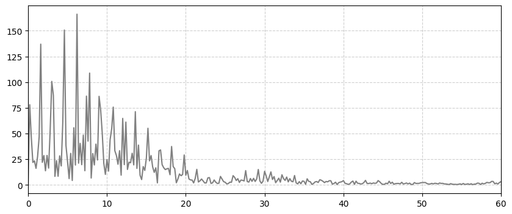
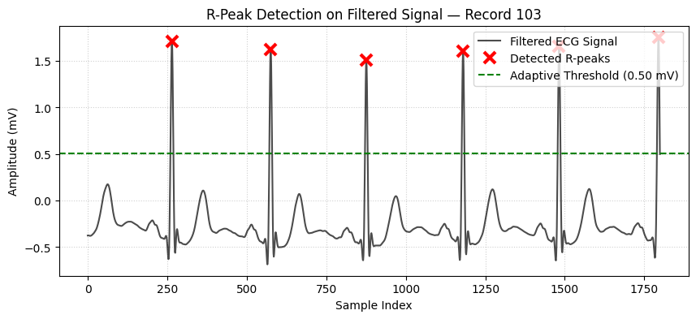
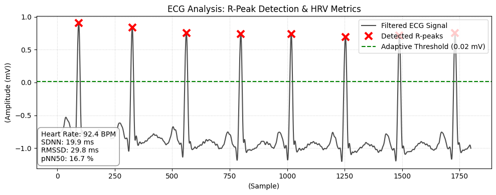

# Robust Algorithmic Pipeline for Clinical ECG Processing and Autonomic Nervous System Evaluation

  
  
  
  

## 📑 Abstract

This repository presents an end-to-end biomedical digital signal processing (DSP) pipeline for the extraction, conditioning, and clinical analysis of Electrocardiogram (ECG) data. The pipeline applies adaptive filtering to remove common artifacts, extracts R-peaks, and performs time-domain Heart Rate Variability (HRV) analysis. It was built as a learning project to explore the core techniques used in biomedical signal processing, with the long-term goal of applying these fundamentals to more advanced physiological monitoring systems.

---

## 🔬 Methodology & Architecture
The signal processing pipeline is organized into three sequential stages, each in its own file:
### 1. 01_biomedical_signal_analysis.py — Baseline Signal Exploration
Data is sourced directly from the MIT-BIH Arrhythmia Database (sampled at 360 Hz). This stage isolates the raw signal, removes baseline wander (DC offset), and performs an initial, unfiltered R-peak detection to establish a reference point.
### 2. 02_Filtered_ECG_Analysis.py — Spectral Analysis & Filtering
To improve signal quality before peak detection, this stage applies two filters:
Zero-Phase IIR Notch Filter: Targets and attenuates 50 Hz powerline interference ($Q=30$).
4th-Order Butterworth Low-Pass Filter: Suppresses high-frequency artifacts (e.g., muscle/EMG noise) with a cutoff frequency ($f_c$) of 30 Hz.
R-peaks are then detected on the filtered signal using scipy.signal.find_peaks with adaptive height and distance thresholds derived from the signal's own statistics (median and percentile-based), rather than fixed hardcoded values.

  
   
  <em>Figure 1: Spectral analysis (FFT) demonstrating the isolation and attenuation of 50 Hz powerline interference using a zero-phase Notch filter.</em>
  
    

  
   
  <em>Figure 2: Signal conditioning utilizing a 4th-Order Butterworth Low-Pass filter to suppress high-frequency physiological artifacts (e.g., EMG noise) while preserving critical QRS morphology.</em>

  
   
  <em>Figure 3: Filtered ECG signal showcasing automated R-peak detection (red markers) utilizing dynamic thresholding (green dashed line).</em>

### 3. 03_HRV_and_Arrhythmia_Flagging.py — HRV & Rule-Based Flagging
Beyond R-peak detection, this stage computes R-R intervals and derives standard time-domain HRV metrics:
SDNN — Standard deviation of R-R intervals; reflects overall heart rate variability.
RMSSD — Root mean square of successive R-R differences; a common indicator of parasympathetic (vagal) activity.
pNN50 — Percentage of successive R-R interval differences exceeding 50 ms.
Average BPM is also compared against standard resting-heart-rate thresholds to flag the recording as consistent with bradycardia (<60 BPM) or tachycardia (>100 BPM). This is a simple rule-based classification of the dataset, not a clinical diagnostic tool.

  
   
  <em>Figure 4: Heart Rate Variability (HRV) metrics extraction and arrhythmia diagnostic flagging.</em>

---

⚠️ Scope & Limitations
This project was developed for learning and portfolio purposes. A few things worth noting:
 ● Peak-detection thresholds and filter parameters were tuned on specific MIT-BIH records and have not been validated across the full database.

 ● The bradycardia/tachycardia flagging is a simple threshold rule, not a validated diagnostic method.

 ● This pipeline has not been tested for real-time / low-latency use and is not intended for clinical or medical-device     applications in its current form.
 
---

🚀 Potential Future Directions
The techniques implemented here — digital filtering, adaptive peak detection, and HRV analysis — are foundational building blocks for more advanced physiological monitoring systems (e.g., wearable devices or home health-monitoring tools). Extending this pipeline with premature ventricular contraction (PVC) detection and validating it against a broader set of records are natural next steps.

---

## 💻 Technical Stack
Language: Python 3.x
Core Libraries: numpy (array operations), scipy (FFT, signal filtering, peak detection), matplotlib (plotting), wfdb (reading PhysioNet data)
Installation & Execution
# 1. Clone the repository:
   git clone https://github.com/ali-xfactor/biomedical_signal_analysis.git

# 2. Install dependencies:
pip install numpy scipy matplotlib wfdb

# 3. 3. Download the dataset:
Download a record (e.g., 100 or 122) from the MIT-BIH Arrhythmia Database on PhysioNet — you'll need both the .dat and .hea files — and place them in the same directory as the scripts.

# 4. Run the pipeline:
Each stage is a standalone script:
     python 01_biomedical_signal_analysis.py
     python 02_Filtered_ECG_Analysis.py
     python 03_HRV_and_Arrhythmia_Flagging.py

---

## 👤 Author
**Ali Farhadi**

**Undergraduate Researcher | Biomedical Engineering**

**Focus: Biomedical Signal Processing & Autonomous Medical Robotics**

## 📚 Acknowledgments & Dataset Attribution
This research relies on the **MIT-BIH Arrhythmia Database**, openly provided by **PhysioNet**. 

Special thanks to the open-source community for maintaining the clinical data structures essential for engineering advancements.
